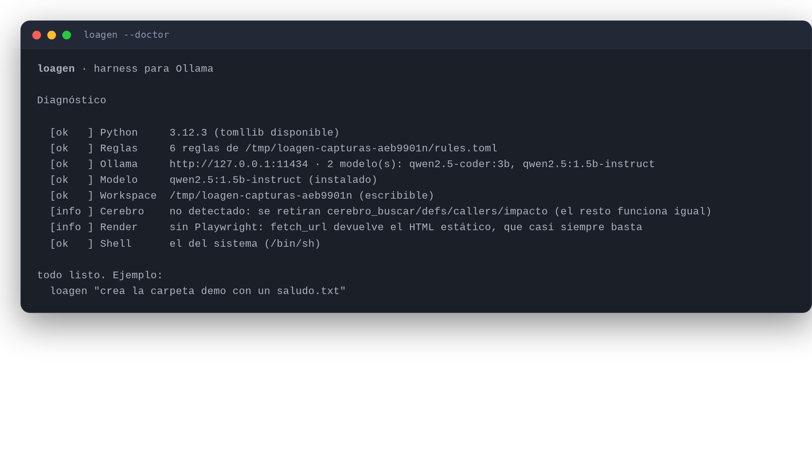
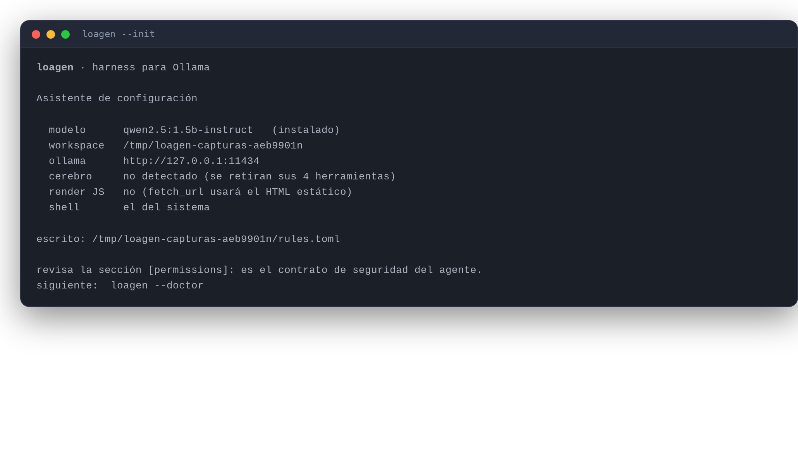
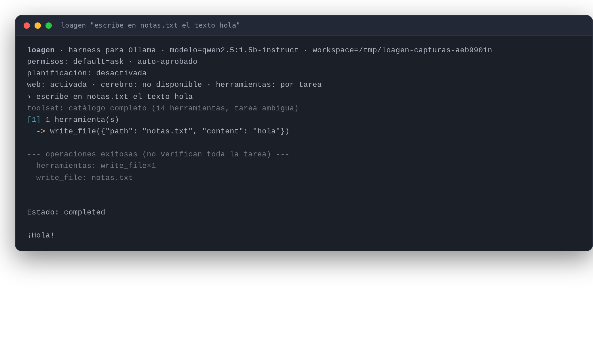
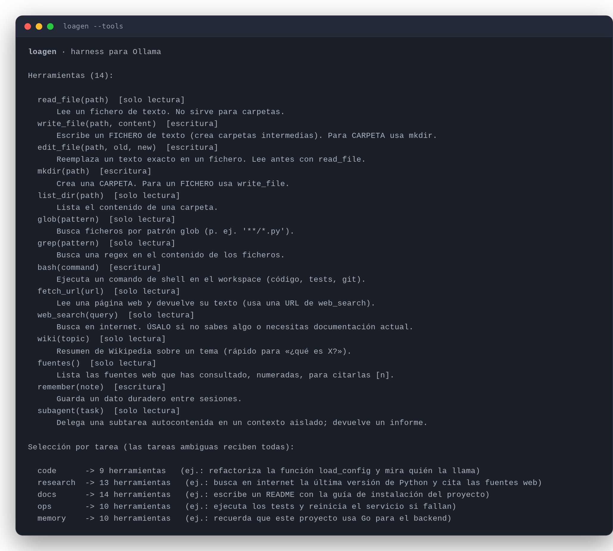

# loagen

> **Actualización de seguridad y arquitectura — octubre 2026.** Consulta
> [la guía vigente](docs/mejoras-harness.md) antes de usar permisos, skills o MCP.
> El contenido histórico de mediciones y capturas de este README no demuestra
> compatibilidad Windows/macOS ni finalización de tareas. `rules.toml` se genera con
> `--init`; no se copia automáticamente desde el checkout al paquete instalado.
> Los códigos de salida actuales son: 0 comprobado mediante contrato explícito,
> 2 error, 3 incompleto/bloqueado y 4 respuesta sin verificación integral.


Harness de agente para modelos locales en **Ollama**, sin dependencias externas
(biblioteca estándar de Python). Da a un modelo como `qwen2.5:1.5b-instruct` lo que
la terminal no le da: **herramientas, permisos, memoria y verificación**.

Nace de analizar el diagrama *Claude Code Architecture* y quedarse con la parte que un
modelo de 1.5B sostiene de verdad — medida, no supuesta. De ahí sale la tabla de
[«Arquitectura»](#arquitectura): cada capa útil tiene aquí su equivalente, y las que este
modelo no aguanta están en [«Límites»](#límites). Lo que se afirmó sin medir está en
[«Lo que medimos»](#lo-que-medimos).



<sub>Capturas hechas con la salida real del harness; se regeneran con
`python3 docs/capturas/generar.py`.</sub>

```
loagen --init                                 # escribe un rules.toml a medida
loagen "escribe en notas.txt el texto hola"   # una tarea
loagen --interactive                          # conversación
loagen --doctor                               # qué falta en este equipo
```

Requisitos: Python 3.11+ (usa `tomllib`), `ollama` corriendo y el modelo descargado
(`ollama pull qwen2.5:1.5b-instruct`). En Python 3.10 o anterior **avisa y sigue** (sin leer
`rules.toml`): ver [«Sistemas soportados»](#sistemas-soportados).

## Instalación

Tres formas, y ninguna añade dependencias: el harness solo usa la biblioteca estándar.

### 1. La carpeta, tal cual

No hace falta instalar nada: se copia el directorio y se ejecuta.

```bash
python3 agente.py "tu tarea"
```

### 2. Script de instalación

Comprueba Python, Ollama y el modelo, y escribe un `rules.toml` a medida:

```bash
./instalar.sh -w ~/mi-proyecto
```

Con Python 3.10 avisa y sigue (igual que el propio harness): configura todo, pero el
`rules.toml` queda sin efecto hasta que actualices el intérprete.

| Flag | Efecto |
| --- | --- |
| `-w/--workspace` | proyecto donde trabajar (def. el directorio actual) |
| `-m/--model` | modelo de Ollama a usar (def. `qwen2.5:1.5b-instruct`) |
| `--no-pull` | no descarga el modelo aunque falte |
| `-y/--yes` | no pregunta nada y sobrescribe `rules.toml` |

### 3. Como comando (pip / pipx)

El paquete declara **cero dependencias** (`dependencies = []`), así que instala en un
segundo y deja el comando `loagen` disponible en cualquier directorio:

```bash
pipx install /ruta/a/loagen        # o: pip install --user /ruta/a/loagen
cd ~/mi-proyecto
loagen --init
```

El paquete declara `requires-python = ">=3.11"`, así que en 3.10 `pip` lo rechaza (ahí usa
la vía 1 o la 2).

### 4. Por plataforma

| Plataforma | Qué hacer |
| --- | --- |
| **Linux** | Cualquiera de las tres vías. Es lo que se ha probado aquí, paso a paso. |
| **macOS** | Igual que Linux: `./instalar.sh` o `pipx install .`. Es POSIX, así que el shell y las reglas encajan. |
| **Windows** | Funciona, con un ajuste: el `bash` del agente usa `cmd.exe` por defecto y los comandos POSIX (`ls`, `grep`, `cat`) no existen ahí. Con **Git Bash** instalado, en `rules.toml`: `shell = "bash"`. Fuera del shell, el resto (ficheros, permisos, memoria) es igual. Bajo **WSL** no hace falta el ajuste. |
| **VPS / servidor sin escritorio** | Igual que Linux y **sin nada gráfico**: el render con Chromium es opcional (si falta, `fetch_url` usa el HTML estático). Para tenerlo arrancado, un servicio `systemd` de usuario con `ExecStart=/usr/local/bin/loagen -w /ruta/al/proyecto` — como cualquier otro proceso. |

Windows y macOS **no se han medido** en este repo (todo lo de [«Lo que medimos»](#lo-que-medimos)
es de Linux): trátalos como «debería funcionar» hasta que alguien lo pruebe.

### Configurar en un minuto

`--init` detecta todo lo que puede detectarse y escribe un `rules.toml` ya usable:

```bash
loagen --init          # escribe rules.toml en el workspace (no pisa uno existente)
loagen --init --force  # lo sobrescribe
```



```
  modelo      qwen2.5:1.5b-instruct   (instalado)
  workspace   /home/usuario/mi-proyecto
  ollama      http://127.0.0.1:11434
  cerebro     /home/usuario/cerebro
  render JS   sí
  shell       el del sistema

escrito: /home/usuario/mi-proyecto/rules.toml
```

Los números que escribe no son inventados: son los medidos en este proyecto (`num_predict`
que evita los bucles de minutos, selección de herramientas porque recorta el prompt, y el
**plan desactivado**, que es lo contraintuitivo y está [medido](#lo-que-medimos): para una
tarea de un paso no aporta nada y cuesta una llamada extra al modelo).

`--doctor` dice qué falta y qué es solo una mejora:

```
  [ok   ] Python     3.12.3 (tomllib disponible)
  [ok   ] Reglas     6 reglas de /home/usuario/mi-proyecto/rules.toml
  [ok   ] Ollama     http://127.0.0.1:11434 · 2 modelo(s): qwen2.5-coder:3b, qwen2.5:1.5b-instruct
  [ok   ] Modelo     qwen2.5:1.5b-instruct (instalado)
  [ok   ] Workspace  /home/usuario/mi-proyecto (escribible)
  [info ] Cerebro    no detectado: se retiran cerebro_buscar/defs/callers/impacto
  [ok   ] Shell      el del sistema (/bin/sh)
```

Devuelve `0` si todo está listo y `2` si algo **impide** ejecutar (Python viejo, Ollama
caído, modelo ausente, `rules.toml` ilegible, shell inexistente). Lo demás son `info`:
mejoran la experiencia, no bloquean.

Todas las claves de `rules.toml` son opcionales; lo que no pongas usa el valor por defecto
del código. Si no existe el fichero, el harness funciona igual con los permisos por defecto.

## Uso



<sub>Salida real de una tarea: la elección de herramientas, la llamada, el bloque
*«verificado por el harness»* y la respuesta.</sub>

```bash
# una tarea
python3 agente.py "lee README.md y dime qué requisitos pide"

# conversación (la memoria persiste entre tareas)
python3 agente.py -i

# workspace y modelo concretos
python3 agente.py -w ~/mi-proyecto -m qwen2.5-coder:3b "arregla el test que falla"

# sin permisos interactivos (solo para sesiones de confianza)
python3 agente.py --yes "formatea el código"

# auditar sin tocar nada
python3 agente.py --read-only "explica qué hace este repo"
```

| Flag | Efecto |
| --- | --- |
| `-m/--model` | modelo de Ollama (def. `qwen2.5:1.5b-instruct`) |
| `-w/--workspace` | raíz de trabajo; las rutas se confinan aquí |
| `--yes` | auto-aprueba los permisos `ask` |
| `--read-only` | **suelo absoluto**: ninguna regla `allow` del fichero lo puede anular |
| `--plan` / `--no-plan` | activa/desactiva la planificación previa (task graph) |
| `--plan-require` / `--no-plan-require` | exige (o no) terminar el plan antes de cerrar |
| `--no-web` | desactiva el navegador (`web_search`, `wiki`, `fetch_url`) |
| `--no-tool-selection` | envía **todas** las herramientas (por defecto se eligen por tarea) |
| `--init` / `--force` | escribe un `rules.toml` detectado en el workspace (y lo sobrescribe) |
| `--doctor` | diagnostica el entorno: sale `2` si algo impide ejecutar |
| `--cerebro-root` | ruta a `cerebro/` (def. autodetectada) |
| `--plan-max-steps` | máximo de pasos del plan (def. 5) |
| `--subagent-model` | modelo de los subagentes (def. el mismo que el principal) |
| `--subagent-max-steps` | tope de pasos de cada subagente (def. 8) |
| `--max-output-tokens` | tope de tokens por turno (def. 512); evita que el modelo se enrolle |
| `--allow-outside-workspace` | permite salir del workspace |
| `-v/--verbose` | muestra las observaciones (salida de cada herramienta) |
| `--rules` | ruta alternativa a `rules.toml` |
| `-i/--interactive` | modo conversación |

### Qué `rules.toml` se usa

Por orden: `--rules <ruta>` → `<workspace>/rules.toml` → el `rules.toml` que va **junto al
harness** (el que se instala con `pip`, o el del repo si trabajas desde ahí).

`rules.toml` es **configuración personal**: describe las rutas, servicios y stacks de tu
máquina, así que este repo **no lo versiona** (está en `.gitignore`). La plantilla pública
es `rules.example.toml`; genera el tuyo con `loagen --init`. Si el harness no encuentra
ninguno, funciona igual con los permisos por defecto (`default = "ask"`).

Los permisos se aprueban en la terminal: `s` (sí), `n` (no) o `t` (todo esta sesión).

## Sistemas soportados

El harness corre **donde corran Python 3.11+ y Ollama**. No tiene dependencias externas
(solo la biblioteca estándar), así que no hay `pip install` ni entorno virtual: se copia
la carpeta y se ejecuta.

| | Estado |
| --- | --- |
| **Linux** | Soportado y **verificado**. Es donde se midió todo lo de [«Lo que medimos»](#lo-que-medimos). |
| **macOS** | Debería funcionar igual: es POSIX, así que el shell y las reglas encajan. No medido en este repo. |
| **Windows** | Arranca, pero necesita ajustes: ver «Windows» abajo. Funciona mejor bajo WSL. |

Lo que exige, y lo que es opcional:

| Requisito | Detalle |
| --- | --- |
| **Python 3.11+** | Obligatorio: `rules.toml` se lee con `tomllib`, que entró en la stdlib en 3.11. |
| **Ollama** | Accesible por HTTP: local (`http://127.0.0.1:11434`, por defecto) o remoto con `--host`. |
| **Modelo** | Descargado y con `tool_calls` nativos (`ollama pull qwen2.5:1.5b-instruct`). |
| Playwright + Chromium | **Opcional**, solo para renderizar páginas con JavaScript. Sin él, `fetch_url` usa el HTML estático y el resto funciona igual. |

Se puede ejecutar **desde cualquier directorio**: el harness localiza su `rules.toml` por
la ruta del propio `agente.py`, no por el directorio actual.

```bash
cd /tmp && python3 /ruta/a/loagen/agente.py -w /tmp/mi-proyecto "tu tarea"
```

### Python 3.10 o anterior

No falla con un traceback: **avisa y sigue**. Sin `tomllib` no puede leer `rules.toml`, así
que arranca con los permisos por defecto (`default = "ask"`) y lo dice por `stderr`,
indicando qué fichero se ignoró:

```
aviso: este Python es 3.10.12 y el harness necesita 3.11+ para leer `rules.toml` (le falta `tomllib`).
       Arranca igual, pero con los permisos por defecto (`default = "ask"`) y sin las reglas deny del fichero.
       Instala Python 3.11+ para recuperar tus reglas.
```

Es una degradación segura —todo lo que muta sigue preguntando— pero **se pierden las
reglas `deny`** de tu fichero (por ejemplo el bloqueo de `rm -rf /`), así que conviene
actualizar el intérprete.

### Windows

Tres piezas asumen POSIX y en Windows hay que ajustarlas:

1. **El shell de `bash`.** Por defecto usa el del sistema, que en Windows es `cmd.exe`,
   y los comandos que genera el modelo (`ls`, `grep`, `cat`) no existen ahí. Con Git Bash
   instalado, en `rules.toml`:

   ```toml
   [loop]
   shell = "bash"        # también vale una ruta completa, p. ej. "C:/Program Files/Git/bin/bash.exe"
   ```

   Si el shell no existe, la herramienta devuelve un error claro en vez de reventar:
   `ERROR: no se pudo usar el shell '...'` con la pista de revisar `rules.toml`.

2. **Las reglas de permisos de `rules.toml`.** Están escritas para comandos POSIX
   (`ls|cat|grep|sed -n`, rutas como `/tmp`). Con `cmd.exe` no casan y todo cae en
   `default` (`ask`); con `shell = "bash"` vuelven a aplicar.

3. **El render con Chromium.** Los flags de arranque están afinados para Linux; se prueban
   tres combinaciones en orden, así que en Windows normalmente arranca, pero si el render
   falla, `fetch_url` sigue devolviendo el HTML estático.

Además, el **cerebro local** y sus scripts son de este workspace Linux: si no encuentra
`cerebro/cerebro.py`, esas herramientas simplemente se retiran del registro en vez de
dar error.

## Arquitectura

Cada capa útil del diagrama tiene su equivalente aquí:

| Diagrama | Aquí | Fichero |
| --- | --- | --- |
| User Interface (CLI) | CLI + modo conversación | `agente.py` |
| Permission Gate (Deny·Allow·Approve) | 3 niveles + `--read-only`/`--yes` | `harness/permissions.py` |
| YAML Rules · 3 tiers | `rules.toml` (TOML: es estándar, no necesita dependencia) | `rules.example.toml` |
| Master Agent Loop (Perception→Action→Observation) | bucle con guards de autocorrección | `harness/loop.py` |
| Task Graph (Dependencies · Priorities) | plan previo saneado, orden topológico y avisos de pasos pendientes | `harness/plan.py` |
| Subagent Spawner (Isolated context · Clean delegation) | subagente con contexto, traza y presupuesto propios; se lee sin verificar | `harness/loop.py` |
| External Servers (Filesystem · Git · Custom) | navegador web (búsqueda, Wikipedia, render) y cerebro local como herramientas | `harness/navegador.py`, `harness/cerebro_tool.py` |
| Tool Dispatch (Typed registry · one handler per tool) | registro tipado, errores como observación | `harness/tools.py` |
| Memory Store (cross-session) | `agent_memory.md` + herramienta `remember` | `harness/memory.py` |
| Context Compressor (3-layer, umbral) | prefijo congelado + resumen elástico | `harness/memory.py` |
| Prompt Cache (stable prefix reuse) | capas 1–2 idénticas entre turnos | `harness/memory.py` |
| Event Bus (Observability) | trazas JSONL por sesión | `harness/trace.py` |
| Task Result (Verified output) | registro de hechos verificado por el harness | `harness/trace.py` |
| MCP Runtime / External Servers | **no** (ver [límites](#límites)) | — |
| Multi-Agent Layer (todo) | **no** (ver [límites](#límites)) | — |

### Herramientas

| Herramienta | Qué hace | Naturaleza |
| --- | --- | --- |
| `read_file` | lee un fichero con números de línea | lectura |
| `write_file` | escribe un fichero (crea carpetas intermedias) | escritura |
| `edit_file` | reemplaza un texto exacto | escritura |
| `mkdir` | crea una carpeta | escritura |
| `list_dir` | lista una carpeta | lectura |
| `glob` | busca ficheros por patrón | lectura |
| `grep` | busca regex en el contenido | lectura |
| `bash` | ejecuta un comando en el workspace | escritura |
| `fetch_url` | descarga una URL y devuelve texto (investigar) | lectura |
| `remember` | guarda un dato duradero entre sesiones | escritura |
| `web_search` | busca en internet (DuckDuckGo, sin API key) | lectura |
| `wiki` | resumen de Wikipedia | lectura |
| `fuentes` | lista las fuentes web consultadas **con su número**, para citarlas | lectura |
| `cerebro_buscar` | busca en el índice local del workspace | lectura |
| `cerebro_defs` | dónde está **definido** un símbolo (fichero y línea) | lectura |
| `cerebro_callers` | qué definiciones **usan** un símbolo, en un salto | lectura |
| `cerebro_impacto` | «¿qué rompe si cambio este símbolo?» (árbol transitivo) | lectura |
| `plan_update` | marca pasos del plan (`'1,2,3'` o `[1,2,3]`); solo existe si hay plan | coordinación |
| `subagent` | delega una subtarea en un contexto aislado; solo si hay profundidad | coordinación |

<details>
<summary>Listado completo de herramientas (salida real de <code>loagen --tools</code>)</summary>



</details>

`plan_update`, `subagent` y `fuentes` se **retiran del registro** cuando no aplican (sin
plan, sin subagentes, sin fuentes): no se le ofrece al modelo una herramienta que solo
devolvería un error. Además, el registro se recorta **por tarea** antes de enviarlo (ver
[«Selección de herramientas»](#selección-de-herramientas-por-tarea)).

### Permission Gate: 3 niveles

En `rules.toml`, **la primera regla que casa gana**; si ninguna casa, decide la
naturaleza de la herramienta (lectura → allow, escritura → `default`):

```toml
[permissions]
default = "ask"      # acción para herramientas que modifican algo

[[permissions.rule]]           # nivel 1: DENY
tool = "bash"
match = "rm\\s+-rf\\s+/"
action = "deny"
reason = "borrado recursivo de raíz"

[[permissions.rule]]           # nivel 3 (allow): comandos inocuos
tool = "bash"
match = "^\\s*(ls|cat|git status)\\b"
action = "allow"
```

### Planificación (Task Graph)

Con `--plan` (o `plan = true` en `rules.toml`), el harness hace **una llamada extra** para
dividir la tarea en pasos con dependencias, antes de tocar nada:

```
plan (3 pasos)
    [1] crear la carpeta calc
    [2] escribir calc.py  (depende de: 1)
    [3] ejecutar el test   (depende de: 2)
```

Qué hace el harness con ese plan:

* **Sanea el grafo.** Un 1.5B inventa ids, dependencias y ciclos: las dependencias que
  apuntan a pasos inexistentes se descartan y los ciclos se rompen (Kahn), así que
  **siempre** existe un orden válido. Dependencias y prioridades se usan para ordenar la
  lista y saber cuál es el siguiente paso, y se le muestran al modelo; **no bloquean**
  herramientas (bloquear exige una fiabilidad que este modelo no tiene).
* **No cambia la caché de prefijo.** La *estructura* del plan (ids, textos, dependencias)
  va al prefijo congelado y es inmutable; el *estado* viaja en las observaciones de
  `plan_update`. Si el estado fuera al prefijo, cada avance invalidaría el prompt cache.
* **Degrada en limpio.** Si el modelo no devuelve un plan usable, o se cae, o tarda de
  más, la ejecución sigue **sin plan** (evento `plan_none` en la traza). Un plan de un solo
  paso se descarta. La planificación nunca puede tumbar una ejecución.
* **Avisa si no termina.** Si quiere cerrar con pasos pendientes, se le recuerda cuál
  toca y que puede marcar varios de una vez (`plan_update('1,2,3', 'done')`), hasta
  `plan_max_nudges` veces.

### Subagentes (contexto aislado)

La herramienta `subagent` delega un encargo autocontenido en un bucle nuevo:

```
python3 agente.py --subagent-model qwen2.5-coder:3b "delega en un subagente que revise..."
```

* **Aislamiento real**: historial, compresor y **traza propios** (`<sesión>.sub1.jsonl`).
  La traza separada no es cosmética: el padre deduce si el paso falló leyendo hacia atrás
  hasta su último `model_call`, y las llamadas del hijo lo confundirían.
* **Nunca más permisivo que el padre**: no puede preguntar por permisos, así que va en
  `read_only` salvo que el padre lleve `--yes`, y `--read-only` gana siempre.
* **Sin recursión**: profundidad máxima 1, planificación desactivada dentro.
* **Delegación limpia pero sin credulidad**: al padre le vuelve un informe recortado, con
  los hechos que el harness verifica (qué herramientas usó el hijo) separados del resumen
  del hijo. Si el hijo no usó **ninguna** herramienta o falló, el informe empieza por
  `ERROR` y el padre lo trata como paso fallido y se recupera.

### Navegador web

Sin claves de API. Tres piezas:

* **`web_search`** — DuckDuckGo HTML. Sus enlaces vienen redirigidos (`/l/?uddg=<url>`),
  así que hay que decodificar `uddg` para devolver la URL real y descartar anuncios.
* **`wiki`** — la API REST de Wikipedia da el resumen directo, sin parsear HTML. Es la
  vía rápida para «¿qué es X?».
* **`fetch_url`** — lee una página concreta. Si el HTML estático da menos de 400
  caracteres, **renderiza con Chromium** (Playwright) para ejecutar el JavaScript.

Detalle medido e importante del render: con los flags habituales (`--no-sandbox
--disable-dev-shm-usage --disable-gpu`) Chromium **crashea** en este entorno
(`Page.goto: Page crashed`); con `--single-process` o `--no-zygote` funciona. El módulo
prueba varias combinaciones en orden y, si todas fallan, dice **por qué** en el error en
vez de devolver silencio.

El guard de ignorancia cierra el círculo: si el modelo responde «no lo sé» sin haber
buscado, se le rechaza la respuesta y se le obliga a usar `web_search`.

#### Fuentes citables

Un 1.5B cita URLs de memoria. Medido: tras buscar «última versión de Python» encontró
3.14.8 en python.org (correcto) y **se inventó la fecha de salida**. Para que eso no
quede sin rastro, el navegador **registra lo que consulta** en
`.loagen/fuentes.jsonl` (una línea JSON por fuente) y la herramienta `fuentes`
devuelve la lista **numerada** para citar `[n]`:

```
FUENTES CONSULTADAS (cita el número, p. ej. [2])
[1] búsqueda: last stable version of Python
[2] resultado: https://python.org/downloads/ — Download Python  [NO leída: solo resultado de búsqueda]
[3] url: https://peps.python.org/             [leída con fetch_url]
```

Tres detalles con motivo:

* **Fuera del prompt.** La lista crece en cada paso; meterla en el prefijo congelado
  invalidaría la caché de prompt de Ollama en cada búsqueda. El modelo la pide con
  `fuentes`, y el CLI la imprime al final (numerada) para que el usuario compruebe cada
  cita.
* **Leída ≠ vista.** Una URL que solo salió en resultados de búsqueda se marca
  `[NO leída]` y no cuenta como fuente; el guard de citación solo exige citar lo leído.
* **Persiste entre sesiones.** El JSONL es del workspace, no de la sesión: lo consultado
  ayer se puede citar hoy.

El guard de citación se activa cuando la tarea pide fuentes **y** hay páginas leídas sin
citar: se obliga a llamar a `fuentes` antes de cerrar. No se dispara si el modelo no ha
leído nada (ahí el aviso correcto es el del navegador).

### Cerebro local

El cerebro (`cerebro/`) es el índice SQLite del workspace: 1-2 ms por consulta frente a
recorrer ficheros (250-650× más rápido, medido en su `AGENTS.md`). Se expone como
cuatro herramientas y **se retiran del registro** si el cerebro no está:

* `cerebro_buscar(consulta, limite)` — búsqueda léxica. **`limite` va topado a 10**
  (medido: un 1.5B pidió 100 y eso disparó el prompt del paso siguiente a 2.638 tokens,
  26 s solo de evaluación).
* `cerebro_defs(simbolo)` — dónde está definido. Lista **todas** las coincidencias: el
  índice estructural busca por el nombre desnudo (`Repo.Save` → `Save`), así que puede
  haber varias y elegir una por el modelo sería inventar.
* `cerebro_callers(simbolo)` — qué definiciones lo usan, **en un salto**. Es la pregunta
  corta y fiable («¿quién llama a esto?»); para el árbol completo está `impacto`.
* `cerebro_impacto(simbolo)` — quién usa un símbolo, transitivo.

Las tres consultas del índice estructural salen en **JSON** (`codeindex.py <modo> --json`)
para parsearlas sin adivinar; el resultado se formatea compacto y se recorta (12
entradas por defecto) porque el contexto de un 1.5B es corto.

La búsqueda avisa cuando cae en modo **OR**: eso significa que alguna palabra no existe
en el índice y el ranking es ruido (`cerebro/AGENTS.md`), así que en vez de dejar que el
modelo se fíe, se le pide reformular con 3 palabras clave exactas.

**Un 0 del índice no significa que el símbolo no exista.** Medido en este workspace: el
índice estructural se construyó antes que este proyecto, así que
`cerebro_defs ToolContext` devuelve 0 aunque el símbolo esté en disco. Por eso el
mensaje de "sin resultados" nombra las dos causas (nombre inexacto o proyecto sin
indexar) y manda a `grep`/`read_file`; si el índice está viejo, `codeindex.py build`.

### Selección de herramientas por tarea

En CPU la latencia la manda el **prompt**, y el catálogo de herramientas es una parte
fija de él. Con 19 herramientas (~1.256 tokens de esquemas) cada ejecución paga segundos
solo por declararlas. Por eso el bucle elige un **grupo según la tarea** antes de
construir el registro:

| Grupo | Cuándo se elige |
| --- | --- |
| `code` | refactor, símbolos, quién llama a algo, ficheros de código |
| `research` | buscar en internet, documentación, versiones, citar fuentes |
| `docs` | escribir/redactar README, guías, notas |
| `ops` | ejecutar tests, compilar, desplegar, servicios, logs |
| `memory` | recordar un dato entre sesiones |

Tres decisiones que evitan que esto rompa tareas:

* **Siempre van el núcleo** (`read_file`, `write_file`, `edit_file`, `mkdir`, `list_dir`,
  `glob`, `grep`, `bash`) **y la coordinación** (plan y subagentes): la selección recorta
  lo opcional, no lo que cualquier tarea puede necesitar.
* **Ante la duda, catálogo completo.** Si la tarea no encaja en ningún grupo o empata
  entre varios, se envían todas. Es una optimización, no una apuesta: elegir mal cuesta
  más que no elegir.
* **Lo que no se envía no existe para el modelo.** El recorte se aplica al construir el
  registro (`Registry(ctx, only=...)`), así que nunca hay una herramienta declarada que
  devuelva «no existe».

El clasificador es determinista (regex sobre la tarea), no una llamada al modelo: una
llamada de clasificación costaría más que lo que ahorra. Y `--tools` enseña cuántas
herramientas recibiría cada grupo, para no confundir «declaradas» con «enviadas».

### Memoria y contexto

* `.loagen/agent_memory.md` — memoria persistente; la herramienta `remember`
  escribe ahí y se inyecta al arrancar cada turno.
* `.loagen/fuentes.jsonl` — fuentes consultadas, numeradas y citables (no se
  inyectan en el prompt: ver [«Fuentes citables»](#fuentes-citables)).
* El prompt de sistema (reglas + memoria) va **congelado al principio** y solo el
  historial varía: así Ollama reutiliza el prefijo en su caché de prompt.
* Al acercarse al umbral (`compress_threshold`, 85 % de `num_ctx`), el historial
  antiguo se resume y las observaciones largas se recortan. Las capas congeladas no
  se tocan, para que el modelo no pierda sus instrucciones.

### Trazas

Cada sesión deja `.loagen/traces/<fecha>.jsonl` con cada `model_call`
(tokens y segundos), `tool_call`, `permission`, `retry` y `final`. Es el "Event Bus"
del diagrama, sin daemon threads.

## Guards de autocorrección

Un 1.5B falla de formas previsibles. El bucle las detecta de forma **determinista**
y le empuja a actuar una vez más (`max_retries`, def. 2) en vez de aceptar la
respuesta. El aviso se envía como mensaje `user` y **no** se reinyecta la prosa del
modelo.

| Falla observada | Guard |
| --- | --- |
| Se rinde con prosa tras un `ERROR` | reintento con instrucción concreta |
| Afirma haber ejecutado (bloque ```` ```bash ````) sin llamar a `bash` | reintento: «ese bloque no ejecuta nada» |
| Responde de memoria aunque la tarea traiga una URL | reintento: `fetch_url` obligatorio |
| Repite la misma llamada sin avanzar | aviso de bucle en la tercera vez |
| Confunde carpeta con fichero | `mkdir`/`write_file` separadas + error explícito |
| Quiere terminar con pasos del plan pendientes | aviso con el siguiente paso y marcado en lote (`plan_max_nudges`) |
| Se enrolla y agota el tope de tokens | aviso de truncado: pide un resumen breve en vez de continuar |
| Repite las mismas líneas en bucle | aviso de bucle literal |
| El subagente no usa ni una herramienta o falla | el informe vuelve como `ERROR` y el padre se recupera solo |
| Dice «no lo sé» sin haber buscado | guard de ignorancia: `web_search` obligatorio |
| La tarea pide fuentes y no cita ninguna leída | guard de citación: `fuentes` obligatorio |
| Respuesta truncada **y** con plan pendiente | el truncado manda: se reconduce antes de mirar el plan |

Orden de prioridad de los guards: **error > truncado > plan > ignorancia > URL > ejecución
narrada**. El truncado se evalúa antes que el plan por medición: una respuesta cortada por
el **tope** y con el plan pendiente quedaba absorbida por el guard del plan y se aceptaba
una respuesta degenerada.

Además, el harness **nunca presenta la afirmación del modelo como evidencia**:
imprime aparte un registro de hechos (herramientas usadas y ficheros escritos) que
sí puede verificar.

## Lo que medimos

Datos reales de este equipo con `qwen2.5:1.5b-instruct` (no estimaciones):

* Emite **`tool_calls` nativos** por la API de Ollama: ~2,6–5,9 s por turno.
* `qwen2.5-coder:3b` **no** emite `tool_calls` nativos: devuelve el JSON como texto.
  Por eso el cliente también parsea texto (`llm.py`) y acepta ese modelo.
* Confundir carpeta con fichero: con `mkdir` separado y su descripción como guía
  negativa, la tarea «crea `demo/saludo.txt`» se resolvió **a la primera** (2 pasos,
  ~23 s). Sin ese arreglo, el modelo escribió un fichero llamado `demo`.
* El aviso de reintento **funciona como mensaje `user` y falla como `system`**
  (probado con 5 variantes). Reinyectar la prosa del modelo lo ancla en su propio
  error: hay que omitirla.
* El dialecto posicional (`write_file ruta "contenido"`) no interpreta escapes: sin
  convertir `\n` literales, Python da `SyntaxError`. Medido y corregido.
* Modelos pequeños escriben llamadas en 4 dialectos: nativo, JSON suelto,
  `herramienta(args)` y `herramienta arg1 arg2`. El cliente los normaliza todos.
* **El tope de tokens (`num_predict`) es imprescindible en CPU.** Sin él, un subagente se
  enrolló generando ~1.900 tokens a 11,6 tok/s y agotó los 180 s de timeout (log de
  Ollama: `cancel task, n_tokens = 2886`). Con tope, el peor turno baja a ~28-57 s y el
  guard de truncado lo reconduce en el turno siguiente (medido: 54 s → 4,9 s).
* **En CPU la latencia la manda el PROMPT, no la generación.** Del log de Ollama:
  `prompt eval = 12,3 ms/token` (≈81 tok/s) frente a ~11,6 tok/s de generación. Añadir el
  navegador y el cerebro subió el prompt de ~1018 a **~1464 tokens** (~18 s solo de
  evaluación), y la misma tarea pasó de 18 s a **31,8 s**. Comprimir el prompt de sistema
  y las descripciones de herramientas lo bajó a ~1235 tokens y la tarea a **24,0 s**
  (~25 % menos). Ollama sí reutiliza el prefijo (`cached n_tokens = 1203`), así que ese
  coste se paga una vez por sesión, no en cada paso.
* Un informe largo del subagente **desestabiliza al padre**: 1.467 caracteres de ruido
  bastaron para que entrara en un bucle de 512 tokens (57 s). De ahí el recorte a 1.000.
* El subagente **se inventa nombres de fichero** (`ls.py`, `ls2.py`) en vez de listarlos;
  hay que decirle explícitamente que los descubra con `list_dir`/`glob`.
* Un **plan de un solo paso** no aporta nada y dispara un aviso inútil: se descarta.
* Dos fallos de seguridad que aparecieron al escribir los tests: `--read-only` era
  anulable por una regla `allow` del fichero, y un subagente podía escribir en una sesión
  `--read-only`. Ambos corregidos y cubiertos por tests.
* El plan **sí ayuda pero no garantiza**: con el task graph activo, una tarea de 3 pasos
  se completó entera (ficheros escritos + test ejecutado, y el marcado en lote
  `plan_update('1,2,3,4')` funcionó: 4/4 en una sola llamada). En otra ejecución el mismo
  modelo cerró con pasos pendientes y hubo que recordárselo.
* **El planificador reescribía la tarea, y se arregló.** Medido al generar las capturas,
  con la misma tarea simple («escribe en notas.txt el texto hola»), el mismo modelo y 4
  ejecuciones por modo. «Limpia» = artefacto correcto en disco y sin avisos, reintentos ni
  otros alfabetos en la salida:

  | | salidas limpias | tiempo |
  | --- | --- | --- |
  | plan activado, **antes** | **0/4** | ~37 s |
  | plan activado, **después** | **4/4** | ~5 s |
  | plan desactivado | **4/4** | ~5 s |

  La causa estaba en el propio prompt: su ejemplo decía «crear la carpeta demo» y
  «escribir `demo/saludo.txt`», y el modelo **lo copiaba**. Para «escribe en `notas.txt`»
  devolvía «crear la carpeta demo» y «escribir `demo/notes.txt`» — otro fichero, en otra
  carpeta — y el harness lo aceptaba, porque verifica el artefacto **del plan**, no el que
  pediste. Dos arreglos: el prompt ya no enseña nombres inventados y prohíbe renombrar o
  añadir lo que no esté en la tarea; y un guard determinista (`contradicts_task`) descarta
  el plan si habla de otro fichero con la **misma extensión** que la tarea. Un nombre
  derivado (`calculadora` → `tests/test_calculadora.py`) se sigue aceptando.
* Aun así, `--init` genera **`plan = false`**: para una tarea de un paso el planificador
  suele devolver un plan de un paso, que el harness descarta (regla ya existente), así que
  no aporta nada y cuesta una llamada extra al modelo. Actívalo para tareas de varios
  pasos — es lo que enseña la captura de [«Planificación (Task Graph)»](#planificación-task-graph).
* **`plan_require` empeora el resultado con 1.5b** (medido, por eso queda desactivado en
  `rules.toml`): al recibir el rechazo, el modelo se quedó repitiendo `mkdir` de un paso
  ya hecho — 9 pasos, 88,9 s y **cero ficheros** creados, frente a la ejecución sin
  exigirlo, que completó los 2 ficheros y el test. La maquinaria funciona (avisa, no se
  cuelga, cierra con AVISO); el modelo no sabe salir del rechazo. Actívalo con un modelo
  mayor.
* La tarea simple de 3 ficheros tarda **~50-90 s** y tiene mucha varianza (mismo prompt,
  misma máquina): en una tirada 56 s y completa, en otra degeneró. Es la varianza del
  modelo a temperatura 0, no del harness.
* **Las herramientas no son gratis: cada esquema se paga en el prompt.** Cada
  herramienta añade ~65-100 tokens de esquema, y en CPU eso es ~1 s de evaluación cada
  una. Con 19 herramientas el bloque de esquemas son ~5.024 caracteres (~1.256 tokens);
  con 14 son ~3.719 (~929).
* **Seleccionar herramientas por tarea baja la latencia de verdad** (misma tarea de
  código, mismo modelo, mismo equipo, dos ejecuciones seguidas):

  | | paso 1 | paso 2 |
  | --- | --- | --- |
  | catálogo completo (19 herramientas) | 27,92 s, **1702** tokens | 15,20 s, **1920** tokens |
  | selección por tarea (14, grupo `code`) | 20,83 s, **1422** tokens | 12,15 s, **1640** tokens |

  Son **280 tokens** menos y **7,1 s** menos en el primer paso (y 280/3,0 s en el
  segundo), con la misma herramienta elegida (`cerebro_buscar`) en ambas. Una tarea
  ambigua habría recibido las 19. Nota: Ollama reutiliza el prefijo, así que el ahorro se
  concentra en el arranque y cuando el prefijo cambia, no en cada turno.
* **`cerebro_defs`/`cerebro_callers` encuentran lo que `impact` no distingue.** Con
  `run_search` real: `defs` da las 2 definiciones (prototipo y real) y `callers` los 11
  puntos de uso directo con su número de referencias; `impact` da el árbol transitivo
  pero no dice cuántas veces se usa cada uno.
* **El registro de fuentes tenía dos fallos que solo aparecieron ejecutándolo de verdad**
  (no en los tests): (1) una página que primero salía en resultados y luego se leía con
  `fetch_url` se quedaba marcada `[NO leída]`, así que el guard de citación no la veía
  — ahora la entrada **se asciende** a leída conservando su número; (2) el guard no se
  apagaba al citar `[1]`, porque solo buscaba la URL en el texto: el modelo citaba
  correctamente y aun así gastaba los reintentos en un aviso ya cumplido. Los dos están
  cubiertos por tests, incluido uno de punta a punta del bucle.

## Tests

```bash
python3 -m unittest discover -s tests -v
```

Son 224 pruebas y **no necesitan Ollama ni red**: la parte de modelo se sustituye por
modelos falsos. En GitHub corren solas con cada push y pull request, en Linux, macOS y
Windows y con Python 3.11, 3.12 y 3.13 (`.github/workflows/ci.yml`), más un trabajo que
hace `pip install .` y ejecuta el comando `loagen` instalado.

Cubren herramientas, confinamiento de rutas, los 3 niveles de permiso, compresión
de contexto, los 4 dialectos de tool-calling, los guards de autocorrección, el parseo
del navegador y del cerebro (con `_run` sustituido: tests rápidos y sin red), el
registro de fuentes, la selección de herramientas por tarea, el shell configurable de
`bash`, la degradación cuando falta `tomllib` y la puesta en marcha (el `rules.toml` que
genera `--init`, que se valida contra la tabla de decisiones de permisos).

## Límites

Lo que **no** se ha implementado a propósito:

* **Capa Multi-Agent** del diagrama (Subagent Spawner, Teammate Mailboxes, FSM
  Protocol, Autonomous Board, Worktree Isolator). Un 1.5B no sostiene coordinación
  multi-agente; es donde más se rompería. El bucle secuencial ya da resultado.
* **MCP Runtime / auto-discover**: cada servidor añade modos de fallo que el modelo
  no sabe depurar. Se puede añadir como herramienta más adelante.
* **Streaming y ejecución en paralelo**: con respuestas de ~50 tokens no aporta.
* **Aprobación no interactiva**: sin terminal, los permisos `ask` se deniegan. Es
  deliberado; para automatizar hace falta `--yes` explícito.
* El modelo puede **afirmar cosas sin haberlas hecho** cuando la respuesta no
  contiene un bloque de comandos. El harness mitiga los casos detectables y siempre
  separa "lo que dice el modelo" de "lo que el harness verificó"; no lo elimina.
  Medido: tras delegar, el padre afirmó "creé carpetas y descargué los ficheros" sin
  haber creado ni descargado nada (el registro de hechos del harness lo desmiente).
* **Se inventa detalles de lo que encuentra.** Medido: buscó "última versión de Python",
  encontró 3.14.8 en python.org (correcto) y se inventó la fecha de salida. Por eso el
  bloque verificado lista las **fuentes consultadas**: el harness no puede comprobar que
  cada frase salga de ahí, pero deja la lista a la vista para que la compruebes.
* **El subagente con `qwen2.5:1.5b-instruct` suele no compensar**: la maquinaria es
  correcta y segura (contexto y traza aislados, `read_only` por defecto, sin recursión),
  pero el modelo delega mal y el coste en tiempo es alto (una delegación midió 3m19s).
  Tiene sentido con un modelo mayor: `subagent_model = "qwen2.5-coder:3b"`.
* No hay paralelismo ni varios subagentes a la vez: es secuencial a propósito, para no
  abrir modos de fallo que un 1.5B no sabe depurar.
* **El guard del plan solo alcanza a los nombres de fichero.** Si la tarea no nombra
  ningún fichero no hay nada que comparar, y un plan que invente nombres pasa el filtro.
  Desde el arreglo del prompt es raro (ver [«Lo que medimos»](#lo-que-medimos)), pero para
  una tarea importante conviene leer el plan que se imprime antes de dejarlo correr:
  el harness verifica el artefacto del plan, no el que pediste tú.
* **El plan no es exigible con este modelo.** Medido: la estructura del plan sale bien
  (3 pasos con dependencias correctas) y el trabajo se completa, pero el modelo a veces
  ignora los avisos y responde en prosa *«Plan marcado como done para el paso [1]»* sin
  llamar a `plan_update`. El harness no acepta esa frase como evidencia: el registro de
  hechos muestra `mkdir×1, write_file×1` y ningún `plan_update`, así que la afirmación
  queda desmentida a la vista. Los avisos están presupuestados (`plan_max_nudges`) para
  no gastar la ejecución peleándose con el modelo.

## Estructura

```
loagen/
├── agente.py              # CLI
├── instalar.sh            # instalador sin dependencias (Python, Ollama, --init, --doctor)
├── pyproject.toml         # paquete sin dependencias -> comando `loagen`
├── LICENSE                # MIT
├── .github/workflows/     # CI: tests en Linux, macOS y Windows
├── rules.example.toml     # plantilla mínima comentada (la que se versiona)
├── rules.toml             # config personal del workspace (NO versionada, ver .gitignore)
├── harness/
│   ├── config.py          # carga de config y decisión de permisos
│   ├── bootstrap.py       # detección del entorno, `--init` y `--doctor`
│   ├── llm.py             # cliente de Ollama + normalización de tool-calls
│   ├── tools.py           # registro tipado de herramientas
│   ├── permissions.py     # Permission Gate
│   ├── plan.py            # Task Graph: parseo, saneo y orden topológico
│   ├── memory.py          # memoria persistente + compresión + registro de fuentes
│   ├── toolset.py         # selección de herramientas por tarea (menos prompt)
│   ├── cerebro_tool.py    # búsqueda, defs, callers e impacto del cerebro local
│   ├── navegador.py       # web_search, wiki, fetch_url (render opcional)
│   ├── trace.py           # event bus / trazas JSONL
│   └── loop.py            # Master Agent Loop + guards + subagentes
├── docs/
│   └── capturas/          # capturas del README + el script que las regenera
└── tests/
    ├── test_harness.py    # herramientas, guards, plan, aislamiento
    ├── test_navegador.py  # parseo web y cerebro (parseo, degradación, fuentes)
    ├── test_toolset.py    # selección de herramientas por tarea
    ├── test_bootstrap.py  # asistente, diagnóstico y el rules.toml generado
    ├── test_plan_require.py # rechazos del plan con tope
    └── test_rules.py      # regresión de las decisiones de permisos
```
